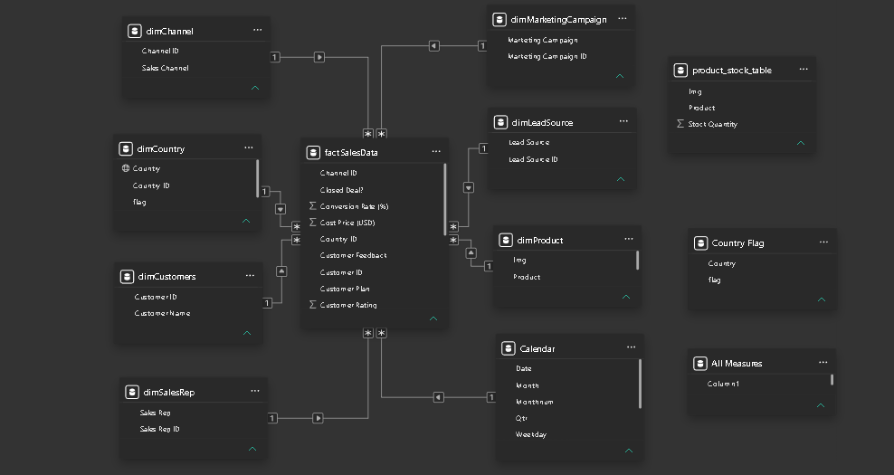
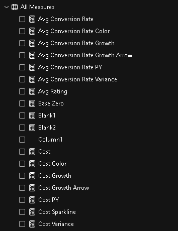
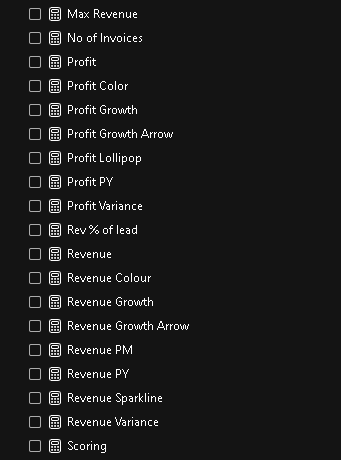
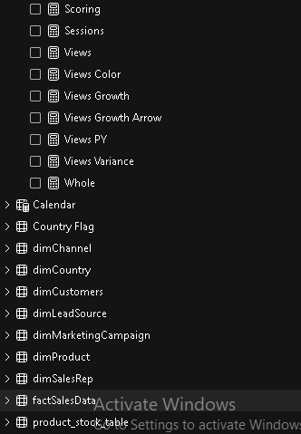
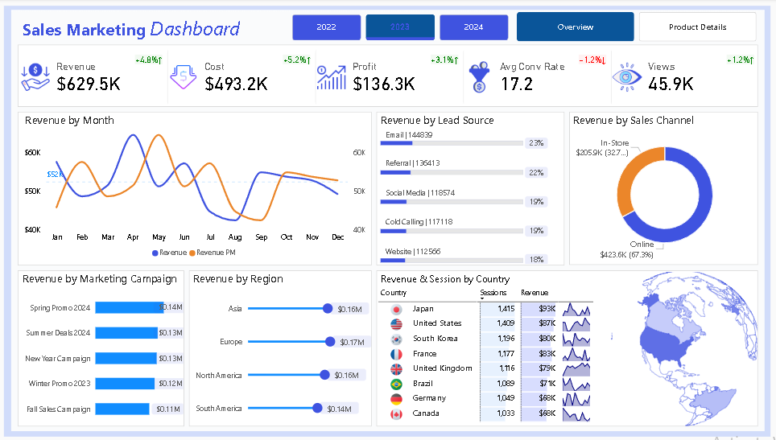
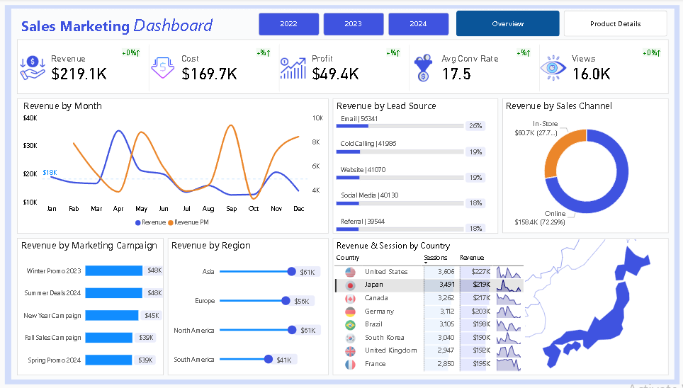
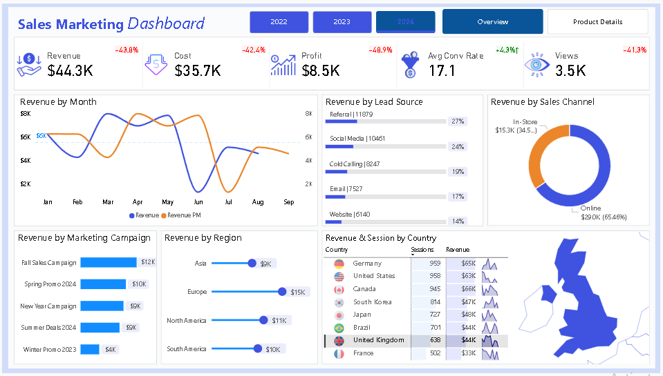
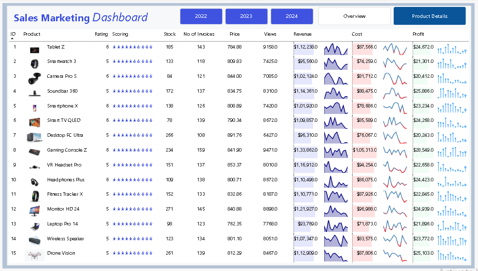

# 📊 Sales Marketing Dashboard

## 📌 Project Overview

This Power BI Sales Marketing Dashboard provides comprehensive insights into sales performance, marketing effectiveness, customer engagement, and revenue generation across multiple channels and regions.

The dashboard enables business stakeholders to monitor KPIs, evaluate campaign performance, analyze customer behavior, and make data-driven decisions to maximize profitability and marketing ROI.

---

## 🎯 Business Objectives

- Monitor overall sales and revenue performance.
- Analyze profit and cost trends.
- Track marketing campaign effectiveness.
- Evaluate lead source performance.
- Measure customer engagement and conversion rates.
- Identify top-performing regions and countries.
- Analyze product-level performance.
- Support strategic business decision-making.

---

## 🛠️ Tools & Technologies Used

- Power BI Desktop
- Power Query
- DAX (Data Analysis Expressions)
- Data Modeling
- Data Cleaning & Transformation
- KPI Development
- Data Visualization

---

## 📊 Dashboard Features

### Overview Page

- Revenue KPI
- Cost KPI
- Profit KPI
- Average Conversion Rate
- Total Views
- Revenue Trend Analysis
- Revenue by Lead Source
- Revenue by Sales Channel
- Revenue by Marketing Campaign
- Revenue by Region
- Revenue & Sessions by Country
- Interactive Slicers

### Product Details Page

- Product-wise Revenue
- Product-wise Profit
- Product-wise Cost
- Product Ratings
- Stock Quantity Analysis
- Product Performance Tracking
- Sparklines for Revenue, Cost & Profit Trends

---

## 📈 Key Insights

### Sales Performance

- Monitored total revenue, profit, and operational costs.
- Identified high-performing products and regions.
- Evaluated revenue trends across multiple years.

### Marketing Analysis

- Compared campaign performance.
- Analyzed lead source effectiveness.
- Tracked conversion rates and customer engagement.

### Customer Analytics

- Evaluated customer ratings and feedback.
- Analyzed customer purchase behavior.
- Measured session and view trends.

### Regional Analysis

- Compared sales performance across countries.
- Identified top-performing markets.
- Tracked regional revenue contribution.

---

## 🗄️ Data Model

The dashboard follows a Star Schema Data Model for optimized performance and scalability.

### Tables Used

#### Fact Table

- factSalesData

#### Dimension Tables

- Calendar
- dimChannel
- dimCountry
- dimCustomers
- dimLeadSource
- dimMarketingCampaign
- dimProduct
- dimSalesRep

#### Supporting Tables

- product_stock_table
- Country Flag
- All Measures

### Data Modeling Features

- Star Schema Design
- One-to-Many Relationships
- Calendar Table for Time Intelligence
- Optimized Data Model for Faster Reporting

### Data Model Preview

---

## 🧮 DAX Measures & KPIs

More than 40 DAX measures were developed to support dynamic reporting and KPI calculations.

### Revenue Measures

- Revenue
- Revenue PM
- Revenue PY
- Revenue Growth
- Revenue Growth Arrow
- Revenue Variance
- Revenue Sparkline
- Revenue Colour

### Profit Measures

- Profit
- Profit PY
- Profit Growth
- Profit Growth Arrow
- Profit Variance
- Profit Lollipop
- Profit Color

### Cost Measures

- Cost
- Cost PY
- Cost Growth
- Cost Growth Arrow
- Cost Variance
- Cost Sparkline
- Cost Color

### Marketing Measures

- Avg Conversion Rate
- Avg Conversion Rate PY
- Avg Conversion Rate Growth
- Avg Conversion Rate Variance
- Avg Conversion Rate Color

### Customer Measures

- Avg Rating
- Sessions
- Views
- Views Growth
- Views Growth Arrow
- Views Variance
- Views Color

### Other Measures

- Max Revenue
- No of Invoices
- Rev % of Lead
- Scoring
- Whole

---

## 📸 DAX Measures Preview

---

## 📷 Dashboard Preview

### Overview Page

### Product Details Page

---

## 📈 Key Insights

- Total Revenue reached $629.5K with a Profit of $136.3K.
- Online Sales Channel contributed over 67% of total revenue.
- Email and Referral channels generated the highest revenue among lead sources.
- Asia and Europe were the top-performing regions.
- Conversion Rate remained above 17%, indicating strong campaign performance.
- Spring Promo 2024 delivered the highest campaign revenue.
- Product-level analysis identified top-performing products based on revenue and profit.

---

## 🎥 Dashboard Walkthrough

A complete dashboard walkthrough video is included in this repository.

**File:** `Sales_Marketing_Dashboard.mp4`

---

## 🚀 Future Enhancements

- Integrate real-time sales and marketing data.
- Add predictive sales forecasting.
- Implement customer segmentation analysis.
- Develop advanced marketing ROI tracking.
- Build customer lifetime value (CLV) analytics.
- Add drill-through pages for campaign-level insights.
- Create executive-level performance dashboards.
- Integrate machine learning models for sales prediction.

---

## ✅ Conclusion

This Sales Marketing Dashboard demonstrates the practical application of Power BI, Power Query, DAX, and data modeling techniques to solve real-world business problems.

The dashboard provides valuable insights into sales performance, customer behavior, marketing effectiveness, and profitability, helping organizations make informed business decisions through interactive and data-driven reporting.

---

## 👨‍💻 Author

**Shaik Irfan**

Aspiring Data Analyst

### Skills Demonstrated

- Data Cleaning
- Data Transformation
- Data Modeling
- DAX Measures
- KPI Development
- Dashboard Design
- Business Intelligence
- Marketing Analytics
- Sales Analytics
- Data Visualization

---

## 🔗 Connect With Me

- GitHub: https://github.com/Irfan-Shaik-45
- LinkedIn: https://www.linkedin.com/in/shaik-irfan-063b65335

---

⭐ If you found this project interesting, feel free to star the repository.
